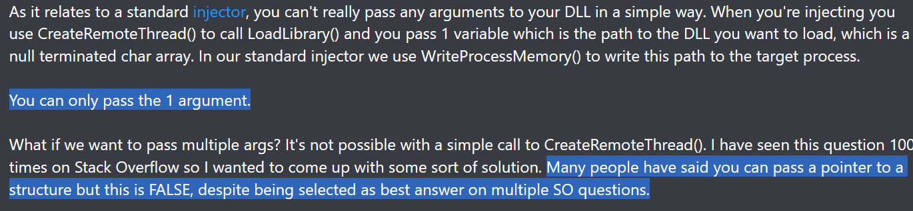
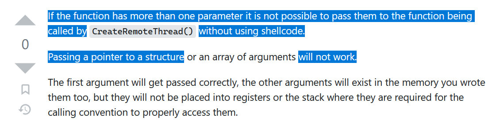
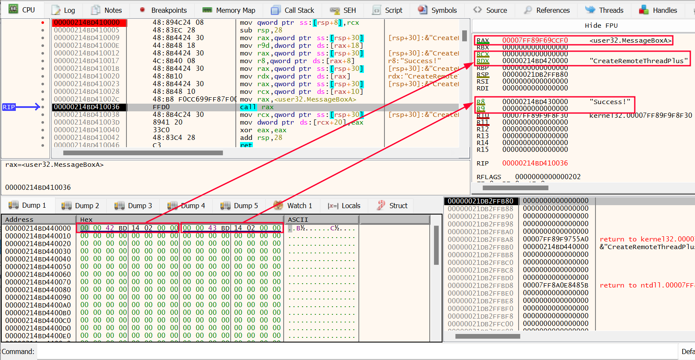
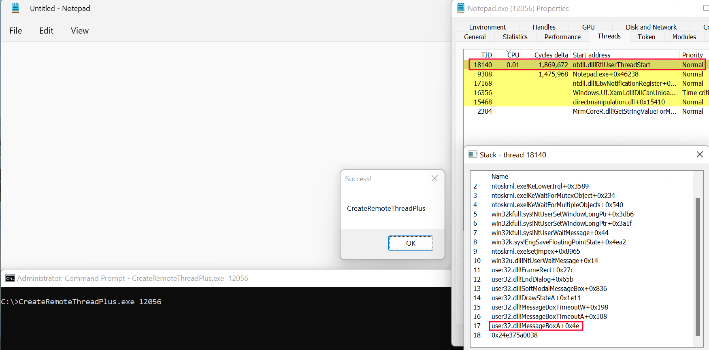

# CreateRemoteThreadPlus
**CreateRemoteThread: how to pass multiple parameters to the remote thread function without shellcode.**

-----------------------------------------------------------------------------------------------------------------------------------------------------------------

## The Function
As stated by the related MSDN page, the CreateRemoteThread API from kernel32.dll *creates a thread that runs in the virtual address space of another process.* This API is often used for process or shellcode injection purposes. Standard dll injection is perhaps the most common amongst these techniques. CreateRemoteThread can 'force' the remote process to load an arbitrary .dll by opening a new thread in it. The LoadLibrary address is passed to the API as LPTHREAD_START_ROUTINE (4th parameter), while a pointer to the string (.dll to be loaded) written in the remote process is passed as 5th parameter.

```c
HANDLE CreateRemoteThread(
  [in]  HANDLE                 hProcess,
  [in]  LPSECURITY_ATTRIBUTES  lpThreadAttributes,
  [in]  SIZE_T                 dwStackSize,
  [in]  LPTHREAD_START_ROUTINE lpStartAddress,
  [in]  LPVOID                 lpParameter,
  [in]  DWORD                  dwCreationFlags,
  [out] LPDWORD                lpThreadId
);
```

-----------------------------------------------------------------------------------------------------------------------------------------------------------------

## The Problem
Standard .dll injection works because the LoadLibrary API expects one parameter only. But what if the remote function expects multiple parameters? What if the function is MessageBox for instance? (MessageBox expects four parameters). I wanted to create this repository because some people on the Internet have said that passing more than one argument to the remote function is impossible.


**Figure 1. People's argument (1)**



**Figure 2. People's argument (2)**

-----------------------------------------------------------------------------------------------------------------------------------------------------------------

## The Solution
This code shows how to handle the aforementioned situation by doing the followings:

1) Writing a data structure containing the parameters into the remote process. This is our LPVOID lpParameter.
2) Writing a \_\_stdcall instruction set into the remote process (no shellcode). This is our LPTHREAD_START_ROUTINE.


### Creating a data structure that holds parameters
MessageBox expects a HWND as first parameter, the second and third parameters are pointers to constant strings (messagebox text and title), the fourth parameter is a UINT (content and behaviour of the messagebox). The data structure will be the following:


```c
typedef struct _USER32_LIB_INPUT_DATA {

	LPCSTR	text;
	LPCSTR	title;
	HWND	hwnd;
	UINT	uType;

} USER32_LIB_INPUT_DATA, * PUSER32_LIB_INPUT_DATA;
```

HWND and UINT are integers, writing them into the struct is as simple as follows:


```c
<snip>

iData = (PUSER32_LIB_INPUT_DATA)LocalAlloc(LPTR, FIELD_OFFSET(USER32_LIB_INPUT_DATA, uType) + sizeof(UINT)); // Allocate the struct
iData->hwnd = inputHwnd;
iData->uType = uType;

<snip>
```


The LPCSTR parameters are pointers to constant strings in the remote process. So the strings are first written into the target process, then the related addresses will be written into the struct like this (lpTextAllocation and lpCaptionAllocation are the returning values of previous calls to VirtualAllocEx):


```c
<snip>

iData->text = (LPCSTR)lpTextAllocation;
iData->title = (LPCSTR)lpCaptionAllocation;

<snip>
```


The result will be a data structure that has to be written into the remote process. The address of this structure will be passed to the LPVOID lpParameter parameter of CreateRemoteThread.


### Creating a __stdcall instruction set before the function call
The remote thread first has to execute instructions that populate the right registers with the right values from the previously written struct. So the program copies the instructions set generated by the function below into the remote process. This will be the 'LPTHREAD_START_ROUTINE lpStartAddress' parameter of CreateRemoteThread.


```c
<snip>

DWORD WINAPI U32MessageBoxGenerateFunctionInstructions(PUSER32_LIB_DATA lpParameter)
{
	lpParameter->output.outputStatus = ((PMESSAGEBOXA)0x4141414141414141)(lpParameter->input.hwnd, lpParameter->input.text, lpParameter->input.title, lpParameter->input.uType);
	return STATUS_SUCCESS;
}
DWORD U32MessageBoxGenerateFunctionInstructions_End()
{
	return 0; 
}

<snip>
```

MessageBoxA is manually declared as WINAPI ('#define __stdcall'). 0x4141414141414141 is just a dummy value that will be swapped with the MessageBoxA address later in the code. This function will generate an instruction set which will properly populate registers to make a MessageBoxA call in accordance with the __stdcall calling convention. The result is the following:



**Figure 3. MessageBoxA instruction set**



**Figure 4. Remote thread executes MessageBoxA**

-----------------------------------------------------------------------------------------------------------------------------------------------------------------


## References
* https://guidedhacking.com/threads/how-to-pass-multiple-arguments-with-createremotethread-to-injected-dll.15373/
* https://stackoverflow.com/questions/25354393/passing-multiple-parameters-using-createremotethread-in-c-sharp
* https://github.com/gentilkiwi/mimikatz


-----------------------------------------------------------------------------------------------------------------------------------------------------------------

#### Notes
Make sure to compile the code using the same compiler/linker options specified in this VisualStudio project. Otherwise the program will not work. I suggest cloning the repository.
